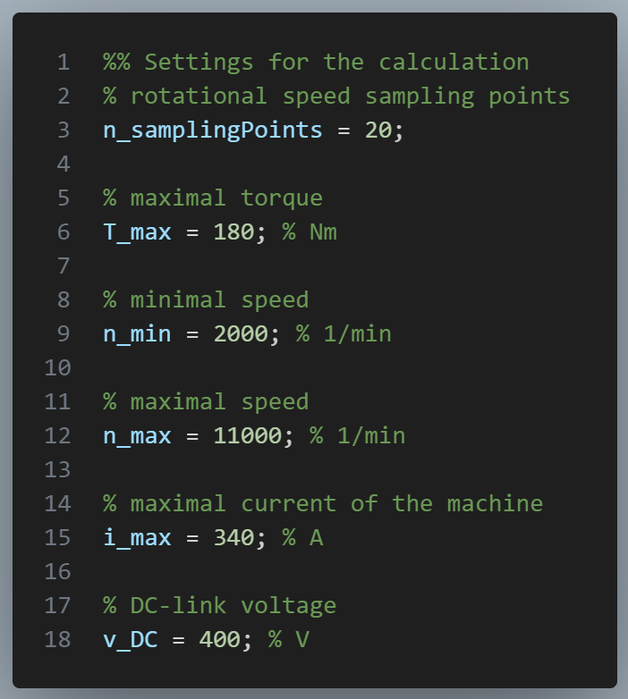
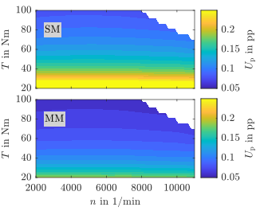
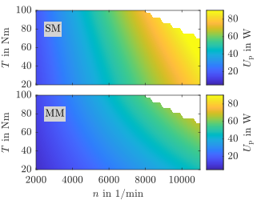

# Evaluation of the Efficiency Measurement Uncertainty of Electric Drive Test Benches for Direct Data-Driven Control Optimization

This GitHub page features the uncertainty-calculation toolchain used in the proposal "Evaluation of the Efficiency Measurement Uncertainty of Electric Drive Test Benches for Direct Data-Driven Control Optimization"


## Motivation
This software is used to determine the measurement uncertainty for electric drive test benches, including the current transducers, power analyzer and the torque flange. 
Therefore, the toolchain is split into different class files, representing the components (electrical machine and inverter) and the measurement equipment. These classes are fed with the specifications of the utilized devices, which makes it easily flexible to exchange the components and the measurement devices.

## Usage
<!-- In the main script, the number of sampling points and the maximum values of the motor are set, as it is shown in the figure below.
 -->

The general settings are defined at the beginning of the evaluation script.
````matlab
%% Settings for the calculation
% rotational speed sampling points
n_samplingPoints = 20;

% maximal torque
T_max = 180; % Nm

% minimal speed
n_min = 2000; % 1/min

% maximal speed
n_max = 11000; % 1/min

% maximal current of the machine
i_max = 340; % A

% DC-link voltage
v_DC = 400; % V
````

Next, the measuring components are selected.
````matlab
% torque flange
% select between
%   T10FS
%   T12HP
torqueFlange_selected = T12HP;

% power analyzer
% select between
%   WT5000
powerAnalyzer_selected = WT5000;

% machine,
motor_selected = HSM_16_17_12_C01;

% semiconductor
semiconductor_selected = FS02MR12A8MA2B;
````

The coverage factor $k_{\mathrm{p}}$ is used to select the confidence interval
````matlab
% coverage factor
% k_p = 1 -> 68.27 % level of confidence
% k_p = 2 -> 95.00 % -------"-----------
% k_p = 3 -> 99.73 % -------"-----------
k_p = 2;
````


## Implementation
To reduce the computation time the main calculation is implemented inside a `parfor` loop. The parallel computing toolbox starts automatically and selects the available number of workers for the parallelization. 


## Output
The expanded uncertainty for an efficiency evaluation with a coverage factor $k_{\mathrm{p}} = 2$ is visualized in percent points (pp) in the figure below.
<p align="center">
  
</p>


To view this result in a different perspective, the uncertainty is visualized, where the maximum uncertainty for the MM procedure is given with 68 W.
<p align="center">
  
</p>


This highlights the usefulness of the MM model in order to carry out efficiency evaluations.


## Sensitivity coefficients
Sensitivity coefficients show the component's uncertainty influence on the total uncertainty. This is very helpful to decerase the systems uncertainty by changing the components with the worst uncertainty first. Therefore, the sensitivity coefficients are calculated in the following, starting with the DC link power as

$$P_{\mathrm{DC}} = V_{\mathrm{DC}} I_{\mathrm{DC}},$$
applying the partial derivative leads to:

$$u_{\mathrm{c,el,dcLink}} = \sqrt{V_{\mathrm{DC}}^2 u_{\mathrm{I,DC}}^2 + I_{\mathrm{DC}}^2 u_{\mathrm{v,DC}}^2}.$$


The uncertainty of the mechanical output power is given with:
$$u_{\mathrm{c,\eta}} = \sqrt{\left(\frac{\partial \eta}{\partial P_{\mathrm{mech}}}\right)^2 u_{\mathrm{c,mech}}^2 + \left(\frac{\partial \eta}{\partial P_{\mathrm{DC}}}\right)^2 u_{\mathrm{c,DC}}^2 } $$

$$ = \sqrt{{\left(\frac{1}{P_{\mathrm{DC}}} \right)}^2 u_{\mathrm{c,mech}}^2 + {\left(- \frac{P_{\mathrm{mech}}}{P_{\mathrm{DC}}^2}\right)}^2 u_{\mathrm{c,DC}}^2}$$


## Parameter
All relevant parameters for the calculation are listed in the table. Moreover, all parameters are marked, if they are operating point dependant. 
|                       |                                   |   Yes     | No        |
| -----                 | ------                            | -----     | ------    |
| **Torque**            |                                   |           |           |
| $T_{\mathrm{max}}$    | Max.\@ measured torque            | &check;   |           |
| $T_{\mathrm{n}}$      | Nominal torque                    |           | &check;   |
| $d_{\mathrm{TC}}$     | Temperature factor                |           | &check;   |
| $d_{\mathrm{TC0}}$    | Temperature factor                |           | &check;   |
| $\Delta T$            | $T_{\mathrm{min}}-T_{\mathrm{max}}$           | &check;   |
| $L_{\mathrm{para}}$   | Parasitic Load                    |           | &check;   |
| $d_{\mathrm{para}}$   | Parasitic Load                    |           | &check;   |
| $d_{\mathrm{dC}}$     | Characteristic tolerance          |           | &check;   |
| $d_{\mathrm{lh}}$     | Linearity with hysteresis         |           | &check;   |
| $\sigma_{\mathrm{rel}}$ | Repeatability                   |           | &check;   |
| $\Delta \theta_{\mathrm{meas}}$ | Temperature difference  |           | &check;   |
| **Rotational speed**  |                     
| $d_{\mathrm{n,lin}}$  | Linearity                         |           | &check;   |  
| $n_{\mathrm{max}}$    | Max. measured speed               | &check;   |           |
| **Amplifier**                
| $d_{\mathrm{amp}}$    | Accuracy                          |           | &check;   | 
| $\Delta \theta_{\mathrm{amp}}$  | Temperature difference  |           | &check;   | 
| $d_{\mathrm{amp,\mathrm{\theta}}}$     | Temperature factor      |    | &check;   |
| **Current transducer** |  
| $d_{\mathrm{CT,lin}}$             | Linearity deviation   |           | &check;   |
| $d_{\mathrm{CT,offset}}$          | Offset                |           | &check;   | 
| $d_{\mathrm{CT,f}}$               | Frequency             |           | &check;   |
| $d_{\mathrm{CT,\varphi,fix}}$   | Fixed angle             |           | &check;   |
| $d_{\mathrm{CT,\varphi,var}}$   | Variable angle          |           | &check;   |
| $I_{\mathrm{CT,MR}}$              | Measurement range     |           | &check;   |
| **Power analyzer** |  
| $d_{\mathrm{i,DC}}$               | Accuracy current DC       |       | &check;   |
| $d_{\mathrm{v,DC}}$               | Accuracy voltage DC       |       | &check;   |
| $d_{\mathrm{i,fund}}$             | Accuracy current fund.    |       | &check;   |
| $d_{\mathrm{i,harm}}$             | Accuracy current harm.    |       | &check;   |
| $d_{\mathrm{v,fund}}$             | Accuracy voltage fund.    |       | &check;   |
| $d_{\mathrm{v,harm}}$             | Accuracy voltage harm.    |       | &check;   |
| $d_{\mathrm{i,DC,MR}}$            | MR current DC             |       | &check;   |
| $d_{\mathrm{v,DC,MR}}$            | MR voltage DC             |       | &check;   |
| $d_{\mathrm{i,fund,MR}}$          | Accuracy current fund.    |       | &check;   |
| $d_{\mathrm{i,harm,MR}}$          | Accuracy current harm.    |       | &check;   |
| $d_{\mathrm{v,fund,MR}}$          | Accuracy voltage fund.    |       | &check;   |
| $d_{\mathrm{v,harm,MR}}$          | Accuracy voltage fund.    |       | &check;   |
| $f_{\mathrm{I_{abc}}}$            | Frequency phase current               | &check;       |   |
| $\varphi$                         | Angle between voltage and current     | &check;       |   |
| $I_{\mathrm{abc}}$                | Phase current                         | &check;       |   |
| $d_{\mathrm{a}}$                  | Accuracy reading analog input         |       | &check;   |
| $d_{\mathrm{MR}}$                 | Accuracy measurement range            |       | &check;   | 


## Specific parameters for the presented calculation in the article
For transparency reasons the used parameters for the calculation in the article are given in the following table.

| Parameter          | Description                  | Value         |
| -------------      | -------------                | ------        |
| **Torque**         |                              | **T12HP**     |
| $T_{\mathrm{N}}$   | Nominal torque               | 100 Nm        |
| $d_{\mathrm{c}}$   | Characteristic tolerance     | 0.0005        |
| $d_{\mathrm{lh}}$  | Linearity with hysteresis    | 0.0001        |
| $\sigma_{\mathrm{rel}}$ | Repeatability           | 0.00005       |
| **Rotational speed** |                            | **T10FS**     |
| $d_{\mathrm{}}$    | 
| $n_{\mathrm{max}}$ | Max. speed                   |12000 1/min   |
| **Amplifier**      |                              |**ML60B**     |
| $d_{\mathrm{amp}}$ | Accuracy                     | 0            |
|**Current transducer**     |                       | **PM-867-400I**|
| $d_{\mathrm{CT,lin}}$| Linearity deviation        | 0.00001      |
| $d_{\mathrm{CT,offset}}$ | Offset                 | 0.00004      |
| $d_{\mathrm{CT,f}}$    | Frequency                | 0.0006 1/kHz |
| $d_{\mathrm{CT,\varphi,fix}}$ | Fixed angle       | 0.01 $^\circ$|
| $d_{\mathrm{CT,\varphi,var}}$ | Variable angle    | 0.06 $^\circ$/kHz|
| $I_{\mathrm{CT,MR}}$ | & Measurement range        | 400 A |
| **Power analyzer**   |                            | **WT5000**| 
|$d_{\mathrm{i,DC}}$   | Accuracy current DC        | 0.0002 |
| $d_{\mathrm{v,DC}}$  | Accuracy voltage DC        | 0.0002 |
| $d_{\mathrm{i,fund}}$| Accuracy current fund.     | 0.0003 |
| $d_{\mathrm{i,harm}}$| Accuracy current harm.     | 0.001  |
| $d_{\mathrm{v,fund}}$| Accuracy voltage fund.     | 0.0003 |
| $d_{\mathrm{v,harm}}$| Accuracy voltage harm.     | 0.001  |
| MR | | |
| $d_{\mathrm{i,DC,MR}}$| MR current DC             | 0.0005 |
| $d_{\mathrm{v,DC,MR}}$| MR voltage DC             | 0.0005 |
| $d_{\mathrm{i,fund,MR}}$ | Accuracy current fund. |0.0004 |
| $d_{\mathrm{i,harm,MR}}$ | Accuracy current harm. |0.0005 |
| $d_{\mathrm{v,fund,MR}}$ | Accuracy voltage fund. |0.0003 |
| $d_{\mathrm{v,harm,MR}}$ | Accuracy voltage fund. |0.0005|
|    % | | | 
| $d_{\mathrm{a}}$     | Accuracy analog input      | 0.0003 |
| $d_{\mathrm{a,MR}}$  | Accuracy MR analog input   | 0.0003 |


## Folder structure
The folder structure is visualized below.
````bash
├── Class_Files
│   ├── inverterModel
│   ├── motorModel
│   ├── powerAnalyzerUncertainty
│   ├── rotationalSpeedAmplifierUncertainty
│   ├── rotationalSpeedUncertainty
│   ├── torqueAmplifierUncertainty
│   ├── torqueUncertainty
│
├── FittedModels
│   ├── fit_lossBrusa.mat
│   ├── fit_Psi_d.mat
│   ├── fit_Psi_q.mat
│   ├── fit_lossBrusa.mat
│   ├── fit_E_on.mat
│   ├── fit_E_off.mat
│   
├── Spec_Files
│   ├── HSM_16_17_12_C01_spec
│   ├── ML60B_spec
│   ├── SkiiP_1242GB120_4D_spec
│   ├── FS02MR12A8MA2B_spec
│   ├── T10FS_spec
│   ├── T12HP_spec
│   ├── WT3000_spec
│   ├── WT5000_spec
│
├── Plot_Files
│   ├── plot_InverterLoss
│   ├── plot_MotorLoss
│   ├── ...
│
└── init
└── testBench_evaluation
````

## Existing components
````bash
├── testBench_evaluation
│   └── init.m
│   │
│   └── motorModel
│       ├── Brusa
│   │
│   └── torqueFlange
│   │   ├── T12HP
│   │   ├── T10FS
│   │    
│   └── powerAnalyzer
│   │   ├── WT3000
│   │   ├── WT5000
│   │    
│   └── currentTransducer
│   │   ├── PM-867-400I
│   │
│   └── measuringAmplifier
│       ├── ML60B
````