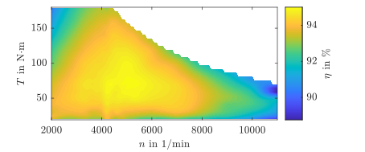

# Evaluation of the Efficiency Measurement Uncertainty of Electric Drive Test Benches for Direct Data-Driven Control Optimization

This GitHub page features the uncertainty-calculation toolchain used in the paper ["Evaluation of the Efficiency Measurement Uncertainty of Electric Drive Test Benches for Direct Data-Driven Control Optimization"](https://www.techrxiv.org/doi/full/10.36227/techrxiv.173603411.17559954/v1).

```
 @article{Hoelsch2025,
  author  = {Hölsch, Lukas and Wallscheid, Oliver},
  title   = {Evaluation of the Efficiency Measurement Uncertainty of Electric Drive Test Benches for Direct Data-Driven Control Optimization},
  journal = {TechRxiv preprint},
  year    = {2025},
  DOI     = {10.36227/techrxiv.173603411.17559954/v1},
 }
```


## Motivation
Optimizing the efficiency of electric drives is a major goal in academia and industry. Due to the already high efficiency of electric drives, the expected improvements are in the single digit and below percentage point range. Therfore, a low measurement uncertainty of the electrical input and the mechanical output power is necessary to compare the efficiency of different drive designs. For the uncertainty evaluation a open-source software has been developed, which calculates the uncertainties.

For the evaluation, this open-source software considers the current transducers, power analyzer and the torque flange. Therefore, the software is split into different class files, representing the electrical machine, inverter and the measurement equipment. These classes are fed with the specifications of the utilized devices, which makes it easy and flexible to exchange the electric drive's components and measurement devices.

The already high efficiency of the electric drive is shown in the figure below.
<p align="center">
  
</p>


## Usage
<!-- In the main script, the number of sampling points and the maximum values of the motor are set, as it is shown in the figure below.
 -->

The general settings are defined at the beginning of the `evaluation.m` script.


````matlab
%% Settings for the calculation
% rotational speed sampling points
n_samplingPoints = 20;

% maximal torque
T_max = 180; % Nm

% minimal speed
n_min = 2000; % 1/min

% maximal speed
n_max = 11000; % 1/min

% maximal current of the machine
i_max = 340; % A

% DC-link voltage
v_DC = 400; % V
````

Next, the measuring components are selected.
````matlab
% torque flange
% select between
%   T10FS
%   T12HP
torqueFlange_selected = T12HP;

% power analyzer
% select between
%   WT5000
powerAnalyzer_selected = WT5000;

% machine
motor_selected = HSM_16_17_12_C01;

% semiconductor
semiconductor_selected = FS02MR12A8MA2B;
````

The coverage factor $k_{\mathrm{p}}$ is used to select the confidence interval
````matlab
% coverage factor
% k_p = 1 -> 68.27 % level of confidence
% k_p = 2 -> 95.00 % -------"-----------
% k_p = 3 -> 99.73 % -------"-----------
k_p = 2;
````


## Results
The expanded uncertainty for an efficiency evaluation with a coverage factor $k_{\mathrm{p}} = 2$ is visualized in percent points (pp) in the figure below. The unvertainty of the MM aproach is significantly lower and mostly uniform distributed within the torque-speed plane.
<p align="center">
  
</p>


To view this result in a different perspective, the efficiency uncertainty is visualized in the figure below, where the maximum uncertainty is given in absolute values of the entire 65 kW electric drive. This figure highlights the usefulness of differentiating the two measurement uncertainty models to showcase that it makes a significant difference if one is interested in measuring the absolute efficiency in a single shot manner (with relatively high uncertainty) or if one wants to optimize the drive performance by comparing multiple operation strategies to each other (with relatively low uncertainty).
<p align="center">
  
</p>


## Sensitivity coefficients
To reduce the measurement uncertainty of a considered existing system design, it is crucial to know the measurement components, for which a small change of their output value have a big impact on the total uncertainty. This is very helpful to decerase the systems uncertainty by changing the components with the worst uncertainty first. Therefore, the sensitivity coefficients are calculated in the following, starting with the torque measurement on the total efficiency by

$$c_{\mathrm{T}} = \frac{\partial \eta}{\partial T} u_{\mathrm{T}} = \frac{\omega_{\mathrm{mech}}}{V_{\mathrm{DC}}I_{\mathrm{DC}}} u_{\mathrm{T}},$$


and for the current measurement as: 

$$c_{\mathrm{I,DC}} = \frac{\partial \eta}{\partial I_{\mathrm{DC}}} = - \frac{T \omega_{\mathrm{mech}}}{V_{\mathrm{DC}} I_{\mathrm{DC}}^2} u_{\mathrm{I,DC}}. $$

Thus, in the figure below, the torque sensitivity coefficient is depicted. The influence of the torque measurement on the resulting uncertainty for the SM model in the low torque region is high, due to the non-ideal utilization of the torque transducer. This influence is neglectable for the MM model, thus the sensitivity coefficient is very low.
<p align="center">
  
</p>

In the figure, the sensitivity coefficient of the current measurement is visualized, where the current measurement of the SM approach has a larger impact on the output uncertainty than the MM approach. Comparing the sensitivity coefficients for the presented exemplary use case, the impact of the torque measurement on the uncertainty is approx. three times higher than the current measurement.
<p align="center">
  
</p>


## Automatic report
After each evaluation an automatic report is generated, which contains the utilized parameters and the results as graphics. For example a preview picute of the report is shown in the figure below.
<p align="center">
  
</p>


## Computational effort
To reduce the computation time the main calculation is implemented inside a `parfor` loop. The parallel computing toolbox starts automatically and selects the available number of workers for the parallelization.

## Folder structure
The folder structure is built as shown below. Hint: This is only for illustration purposes and the real folder structure may contains more files.
````bash
├── Class_Files
│   ├── inverterModel
│   ├── motorModel
│   ├── powerAnalyzerUncertainty
│   ├── rotationalSpeedAmplifierUncertainty
│   ├── rotationalSpeedUncertainty
│   ├── torqueAmplifierUncertainty
│   ├── torqueUncertainty
│
├── FittedModels
│   ├── HSM_1_6_17_12_C01
│       ├── fit_Psi_d.mat
│       ├── fit_Psi_q.mat
│       ├── fit_Torque.mat
│       ├── fit_eta.mat
│   ├── IPMSM_350kW
│       ├── fit_Psi_d.mat
│       ├── fit_Psi_q.mat
│       ├── fit_Torque.mat
│       ├── fit_eta.mat
│   ├── FS02MR12A8MA2B
│       ├── fit_E_on.mat
│       ├── fit_E_off.mat
│   
├── Spec_Files
│   ├── HSM_1_6_17_12_C01_spec
│   ├── HSM_1_6_17_12_C01_fit
│   ├── T10FS_spec
│   ├── T12HP_spec
│   ├── WT5000_spec
│
├── Plot_Files
│   ├── plot_InverterLoss
│   ├── plot_MotorLoss
│   ├── ...
│
└── init
└── testBench_evaluation
````

## Bug report and contributing
If you have any ideas or questions about the content, please open an issue or send me an email at lukas.hoelsch@uni-siegen.de .